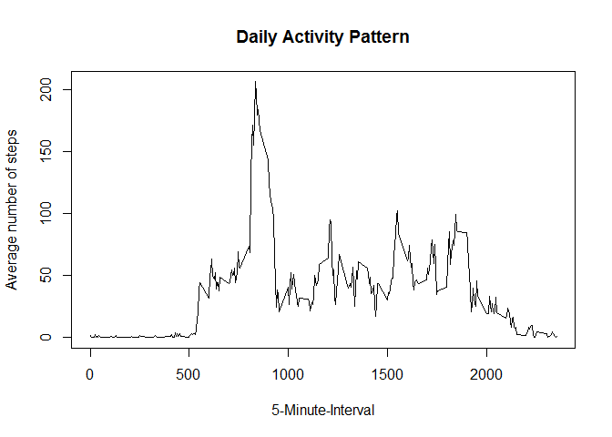
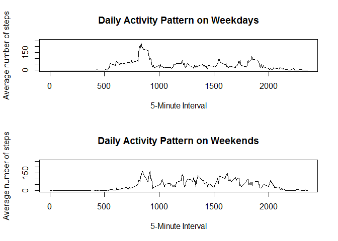

title: "Reproducible Research: Peer Assessment 1"
output: 
  html_document:
    keep_md: true


```r
#Assignment 1
#1.Load  the data
#setwd("C:/users/asaran/R/activity")
activity <- read.csv("activity.csv")
str(activity)
```

```
## 'data.frame':	17568 obs. of  3 variables:
##  $ steps   : int  NA NA NA NA NA NA NA NA NA NA ...
##  $ date    : Factor w/ 61 levels "2012-10-01","2012-10-02",..: 1 1 1 1 1 1 1 1 1 1 ...
##  $ interval: int  0 5 10 15 20 25 30 35 40 45 ...
```

```r
#2. process datsa
activity$date <- as.Date(activity$date)
str(activity)
```

```
## 'data.frame':	17568 obs. of  3 variables:
##  $ steps   : int  NA NA NA NA NA NA NA NA NA NA ...
##  $ date    : Date, format: "2012-10-01" "2012-10-01" ...
##  $ interval: int  0 5 10 15 20 25 30 35 40 45 ...
```

```r
##What is mean total number of steps taken per day?
#For this part of the assignment, you can ignore the missing values in the dataset.
#1. Calculate the total number of steps taken per day
#For this we will need to aggregate the number of steps per day, #remove the na
activity_rm<-activity[which(!is.na(activity$steps)),]
perday<-tapply(activity_rm$steps, activity_rm$date, sum)
#2. histogram of steps taken each day
hist (perday,20, main="Total number of steps taken per day")
```

<!-- -->

```r
#3.Calculate and report the mean and median of the total number of steps taken per day
mean(perday)
```

```
## [1] 10766.19
```

```r
median(perday)
```

```
## [1] 10765
```

```r
##What is the average daily activity pattern?

#1.Make a time series plot (i.e. type = "l") of the 5-minute interval (x-axis) and the average number of steps #taken, averaged across all days (y-axis)
dailyact<-tapply(activity_rm$steps, activity_rm$interval, mean)
plot(y = dailyact, x = names(dailyact), type = "l", xlab = "5-Minute-Interval", 
    main = "Daily Activity Pattern", ylab = "Average number of steps")
```

<!-- -->

```r
#2.Which 5-minute interval, on average across all the days in the dataset, contains the maximum number of steps?
dailyact[dailyact==max(dailyact)]
```

```
##      835 
## 206.1698
```

```r
#The interval where max number of steps are taken is 8:35 with 206.1698 steps
#     835 
#206.1698 

##Imputing missing values

#Note that there are a number of days/intervals where there are missing values (coded as NA). The presence of #missing days may introduce bias into some calculations or summaries of the data.

#1.Calculate and report the total number of missing values in the dataset (i.e. the total number of rows with NAs)
#total number of missing values = 
sum(is.na(activity))
```

```
## [1] 2304
```

```r
#2.Devise a strategy for filling in all of the missing values in the dataset. The strategy does not need to be sophisticated. For example, you could use the mean/median for that day, or the mean for that 5-minute interval, etc.

#3.Create a new dataset that is equal to the original dataset but with the missing data filled in.

activity1 <- activity
activity1[which(is.na(activity1$steps)),1]<- dailyact[as.character(activity1[which(is.na(activity1$steps)),3])]
perday1<-tapply(activity1$steps, activity1$date, sum)
#4.Make a histogram of the total number of steps taken each day and Calculate and report the mean and median total number of steps taken per day. Do these values differ from the estimates from the first part of the assignment? What is the impact of imputing missing data on the estimates of the total daily number of steps?

hist (perday1,20, main="Total number of steps taken per day w/o missing values")
```

<!-- -->

```r
mean(perday1)
```

```
## [1] 10766.19
```

```r
#Answer: imputing missing values does not impact the mean at all, it changes the median only by 1.19 steps.

median(perday1)
```

```
## [1] 10766.19
```

```r
##Are there differences in activity patterns between weekdays and weekends?

#For this part the weekdays() function may be of some help here. Use the dataset with the filled-in missing values for this part.

#1.Create a new factor variable in the dataset with two levels - "weekday" and "weekend" indicating whether a given date is a weekday or weekend 
activity1$wd<-weekdays(activity1$date)
activity1$fwd<- as.factor(c("weekend", "weekday"))
activity1[activity1$wd == "Sunday" | activity1$wd == "Saturday" ,5]<- factor("weekend")
activity1[!(activity1$wd == "Sunday" | activity1$wd == "Saturday"),5 ]<- factor("weekday")

activity1_we <- subset(activity1, fwd == "weekend") 
activity1_wd <- subset(activity1, fwd == "weekday") 
dailyact_we<-tapply(activity1_we$steps, activity1_we$interval, mean)
dailyact_wd<-tapply(activity1_wd$steps, activity1_wd$interval, mean)
max (dailyact_wd)
```

```
## [1] 230.3782
```

```r
max (dailyact_we)
```

```
## [1] 166.6392
```

```r
#2.Make a panel plot containing a time series plot (i.e. type = "l") of the 5-minute interval (x-axis) and the average number of steps taken, averaged across all weekday days or weekend days (y-axis). See the README file in the GitHub repository to see an example of what this plot should look like using simulated data.

#Answer: Weekend activity starts later than weedday activity and ends about the same time as weekdays. 
#Once started, weekend activity is more than weekday activity
#weekday activity shows one peak time in the morning, and then lower activity through out the day. 


par(mfrow=c(2,1))
plot(y = dailyact_wd, x = names(dailyact_wd), type = "l", xlab = "5-Minute Interval", 
   main = "Daily Activity Pattern on Weekdays", ylab = "Average number of steps", 
   ylim =c(0, 250))
plot(y = dailyact_we, x = names(dailyact_we), type = "l", xlab = "5-Minute Interval", 
    main = "Daily Activity Pattern on Weekends", ylab = "Average number of steps", 
    ylim =c(0, 250))
```

<!-- -->

